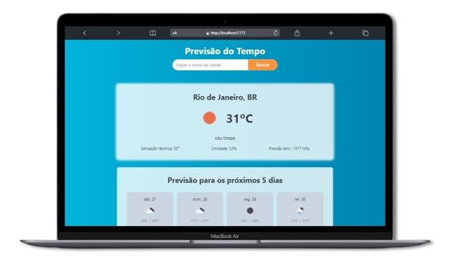
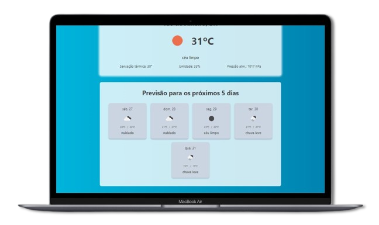

## Previsão do tempo

Este é um simples layout de previsão do tempo. o usuário realiza a pesquisa da cidade e o resultado obtem o tempo do horário atual e previsões para os próximos 5 dias. Projeto iniciado com [Vite](https://vitejs.dev/) e desenvolvido com Typescript. 

&nbsp;
## 👨🏻‍💻 Começando...

Primeiro, execute os seguintes comandos no cmd da sua IDE:

```bash
npm install
```

```bash
npm run dev
```

&nbsp;

👍🏻 Execute o projeto no navegador com a URL `localhost://5173`

&nbsp;
## 💻/📱 Layouts do projeto

&nbsp;
- Home page

| | | 
|--|--|
| | |